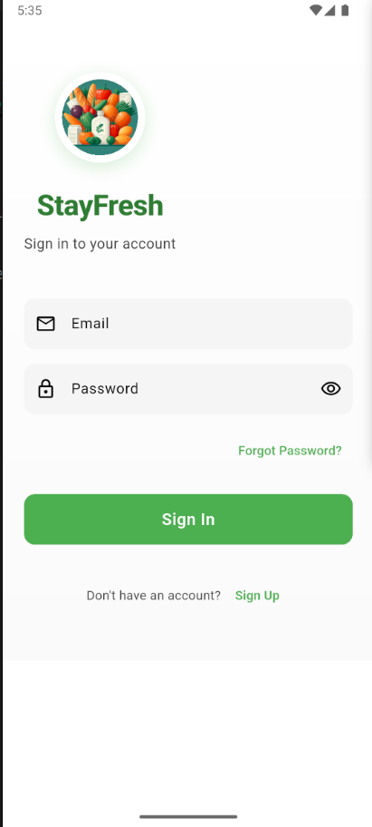
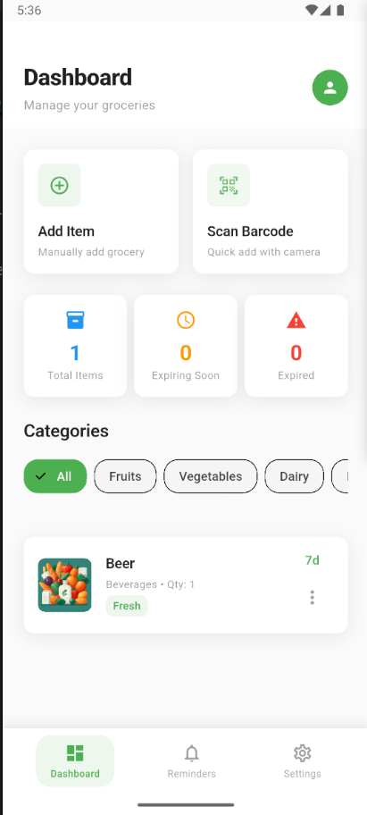
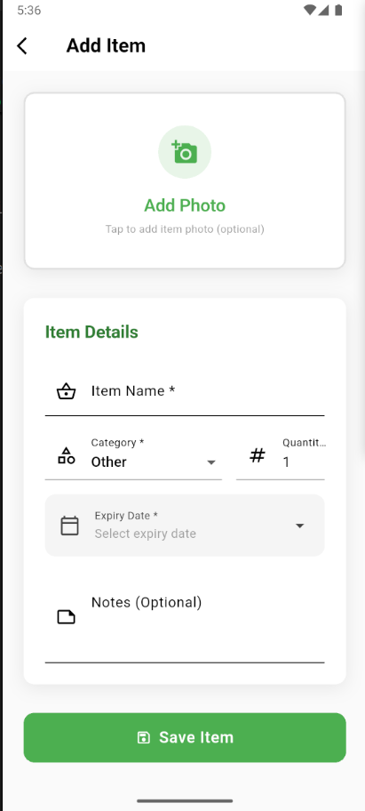
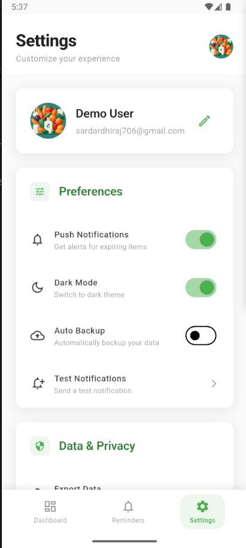

# StayFresh - Smart Grocery Tracker

A Flutter mobile application that helps users track grocery items, monitor expiry dates, and receive notifications when items are about to expire. Built with MVVM architecture and Firebase integration.

## 🚀 Features

- **Smart Inventory Management**: Add grocery items manually or by scanning barcodes
- **Expiry Tracking**: Color-coded status system (Fresh/Expiring Soon/Expired)
- **Push Notifications**: Get alerts 2 days before items expire
- **Barcode Scanning**: Camera-based and manual barcode entry
- **User Authentication**: Email/password login and registration
- **Cloud Storage**: Firebase Firestore for data persistence
- **Offline Support**: Local data with cloud sync

## 🏗️ Architecture

This project follows the **MVVM (Model-View-ViewModel)** pattern for clean separation of concerns:

```
lib/
├── models/           # Data models (GroceryItem, etc.)
├── viewmodels/       # Business logic and state management
├── views/
│   ├── screens/      # App screens (Home, Add Item, Scan, etc.)
│   └── widgets/      # Reusable UI components
├── services/         # External services (Firebase, Barcode, Notifications)
└── utils/           # Helper functions, constants, and themes
```

## 📱 Screens

1. **Splash Screen** - App initialization and authentication check
2. **Login/Register Screen** - User authentication
3. **Home Screen** - Inventory list with tabs (All/Expiring Soon/Expired)
4. **Add Item Screen** - Manual item entry with category selection
5. **Scan Screen** - Barcode scanning functionality

## 🛠️ Tech Stack

- **Framework**: Flutter 3.8+
- **State Management**: Provider pattern
- **Backend**: Firebase (Auth, Firestore, Cloud Messaging)
- **Barcode Scanning**: flutter_barcode_scanner
- **Local Notifications**: flutter_local_notifications
- **Date Formatting**: intl package

## 📦 Dependencies

```yaml
dependencies:
  flutter:
    sdk: flutter
  provider: ^6.1.1
  firebase_core: ^2.24.2
  firebase_auth: ^4.15.3
  cloud_firestore: ^4.13.6
  firebase_messaging: ^14.7.10
  flutter_barcode_scanner: ^2.0.0
  http: ^1.1.0
  intl: ^0.18.1
  flutter_local_notifications: ^16.3.2
  cupertino_icons: ^1.0.8
```

## 🚀 Getting Started

### Prerequisites

- Flutter SDK 3.8 or higher
- Dart SDK 3.0 or higher
- Android Studio / VS Code
- Firebase project setup

### Installation

1. **Clone the repository**
   ```bash
   git clone https://github.com/Dhiraj706Sardar/stayfresh.git
   cd stayfresh
   ```

2. **Install dependencies**
   ```bash
   flutter pub get
   ```

3. **Environment Setup**
   ```bash
   # Copy environment template
   cp .env.example .env
   
   # Edit .env file with your actual credentials
   # NEVER commit .env to git - it contains sensitive data!
   ```

4. **Firebase Setup**
   - Create a new Firebase project at [Firebase Console](https://console.firebase.google.com/)
   - Enable Authentication (Email/Password)
   - Enable Cloud Firestore
   - Enable Cloud Messaging
   - Download `google-services.json` and place it in `android/app/`
   - Get your Web API Key from Project Settings > General
   - Add your Firebase Web API Key to `.env` file

5. **Supabase Setup** (Optional - for advanced features)
   - Create a Supabase project at [Supabase](https://supabase.com/)
   - Get your Project URL and anon key from Settings > API
   - Add credentials to `.env` file

6. **Run the app**
   ```bash
   flutter run
   ```

## 🔧 Configuration

### Environment Variables (.env)

**🔒 SECURITY IMPORTANT**: All sensitive credentials are stored in `.env` file which is **NOT** committed to git.

Required environment variables:
```bash
# Supabase Configuration
SUPABASE_URL=https://your-project-id.supabase.co
SUPABASE_ANON_KEY=your-supabase-anon-key

# Firebase Configuration  
FIREBASE_WEB_API_KEY=your-firebase-web-api-key

# App Configuration
APP_ENV=development
DEBUG_MODE=true
```

**Setup Steps:**
1. Copy `.env.example` to `.env`
2. Replace placeholder values with your actual credentials
3. **NEVER** commit `.env` to version control
4. Share credentials securely with team members (not via git)

### Firebase Configuration

Firebase configuration is handled automatically through:
- `android/app/google-services.json` (Android)
- `ios/Runner/GoogleService-Info.plist` (iOS - if needed)
- Environment variables in `.env` file

### Android Permissions

The following permissions are automatically handled:
- Camera (for barcode scanning)
- Internet (for Firebase)
- Notifications (for expiry alerts)

## 📊 Data Models

### GroceryItem
```dart
class GroceryItem {
  final String id;
  final String name;
  final String category;
  final DateTime purchaseDate;
  final DateTime expiryDate;
  final String? barcode;
  final bool isManualEntry;
  final String userId;
}
```

### Expiry Status
- **Fresh**: More than 2 days until expiry (Green)
- **Expiring Soon**: 2 days or less until expiry (Orange)
- **Expired**: Past expiry date (Red)

## 🔔 Notifications

The app schedules local notifications 2 days before items expire. Notifications include:
- Item name
- Days until expiry
- Tap to open app

## 🎨 UI/UX Features

- **Material 3 Design**: Modern, consistent UI
- **Color-coded Status**: Visual expiry status indicators
- **Responsive Layout**: Works on various screen sizes
- **Smooth Animations**: Enhanced user experience
- **Dark Mode Ready**: Theme system prepared for dark mode

## Screenshots

### Login Page


### Home Screen


### Add Item Screen


### Setting Pzge / Profile Page 



## 🧪 Testing

The app includes dummy data for testing UI components before Firebase integration:

```dart
// Dummy items are automatically loaded in GroceryViewModel
// Remove _loadDummyData() call when Firebase is configured
```

## 🚀 Deployment

### Android
1. Update `android/app/build.gradle` with your signing configuration
2. Build release APK: `flutter build apk --release`
3. Build App Bundle: `flutter build appbundle --release`

### iOS
1. Configure signing in Xcode
2. Build for iOS: `flutter build ios --release`

## 🤝 Contributing

1. Fork the repository
2. Create a feature branch (`git checkout -b feature/amazing-feature`)
3. Commit your changes (`git commit -m 'Add amazing feature'`)
4. Push to the branch (`git push origin feature/amazing-feature`)
5. Open a Pull Request

## 📝 Code Structure

### ViewModels
- `AuthViewModel`: Handles user authentication
- `GroceryViewModel`: Manages grocery items and business logic

### Services
- `FirebaseService`: Firebase operations (Auth, Firestore)
- `BarcodeService`: Barcode scanning functionality
- `NotificationService`: Local and push notifications

### Utils
- `AppTheme`: Consistent theming and colors
- `Constants`: App-wide constants and configuration
- `DateHelper`: Date formatting and calculations
- `Validators`: Form validation utilities

## 🐛 Known Issues

- Barcode product lookup requires external API integration
- Offline mode needs implementation
- Dark theme needs completion

## 🔮 Future Enhancements

- [ ] Recipe suggestions for expiring items
- [ ] Shopping list generation
- [ ] Nutrition information integration
- [ ] Barcode product database integration
- [ ] Social sharing features
- [ ] Analytics and insights
- [ ] Multi-language support

## 📄 License

This project is licensed under the MIT License - see the [LICENSE](LICENSE) file for details.

## 📞 Support

For support, email sardardhiraj706@gmail.com or create an issue in the repository.

---

**StayFresh** - Never let your groceries go bad again! 🥬✨

**Note:** This project is still under active development. Features and structure may change as work progresses.
